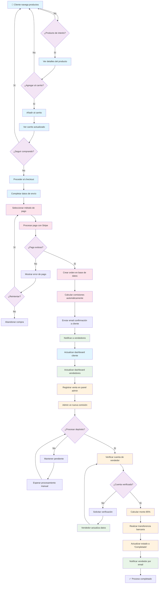
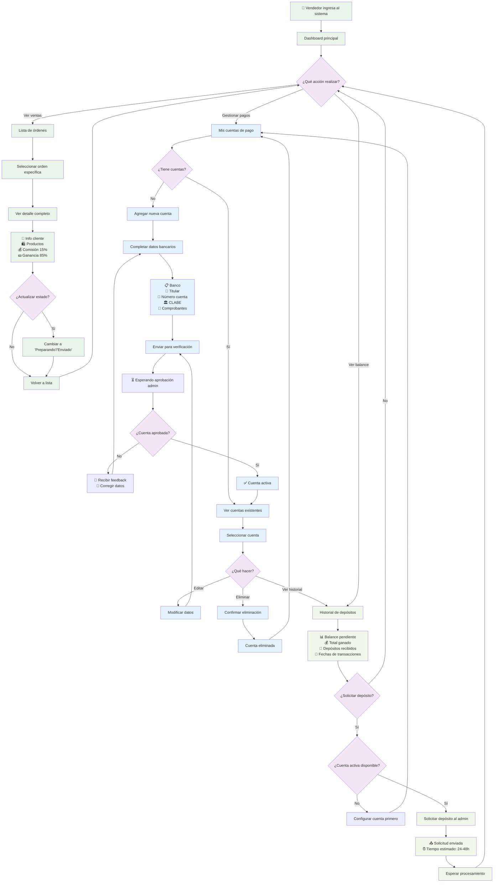
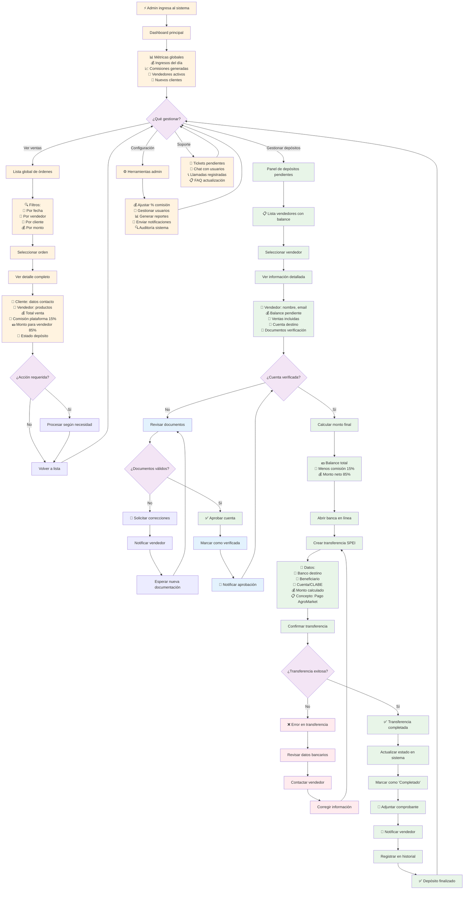
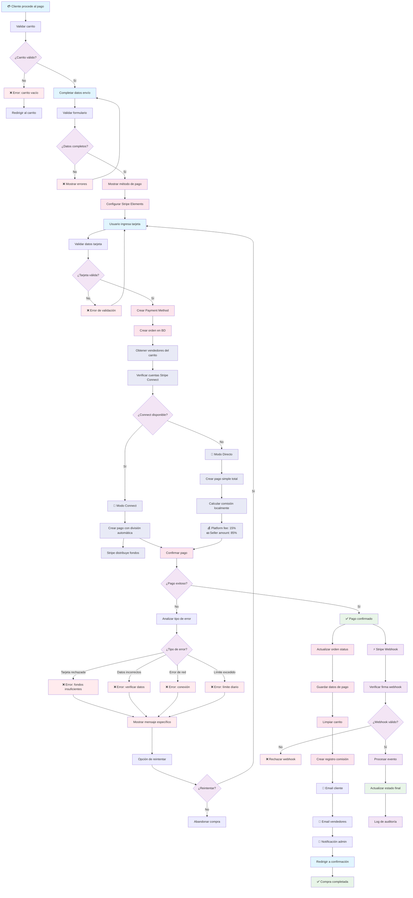
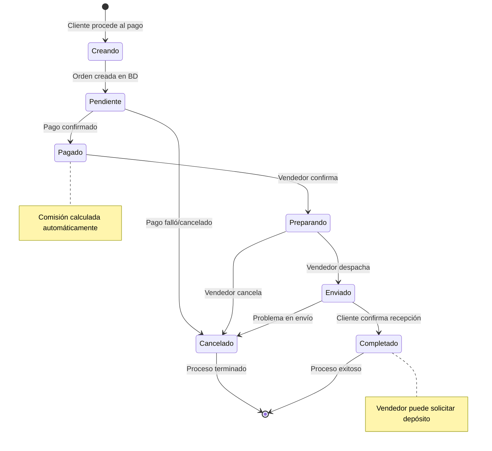
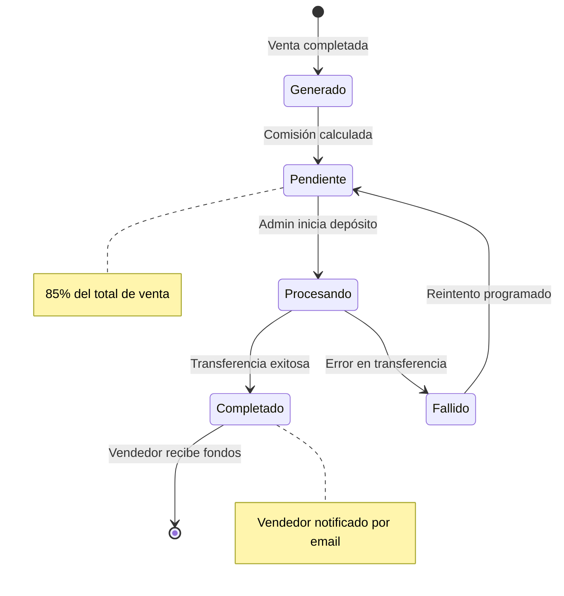
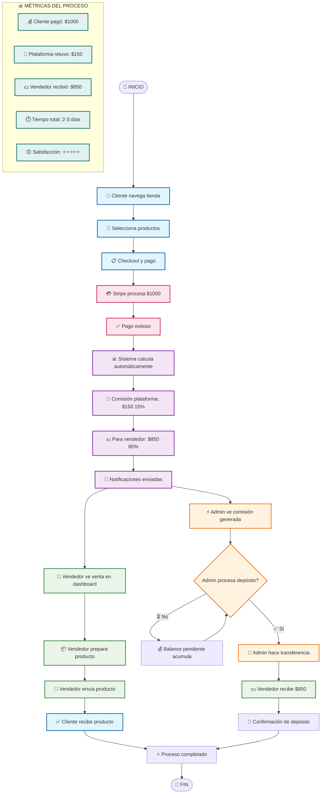

# 🔄 DIAGRAMA DE FLUJO VISUAL: PROCESO COMPLETO DE COMPRA AGROMARKET

## 📊 FLUJO PRINCIPAL DEL SISTEMA

## 🏪 FLUJO ESPECÍFICO DEL VENDEDOR

## ⚡ FLUJO ESPECÍFICO DEL ADMINISTRADOR

## 💳 FLUJO ESPECÍFICO DEL PROCESO DE PAGO

## 📊 FLUJO DE ESTADOS DE LA ORDEN

## 💰 FLUJO DE ESTADOS DEL DEPÓSITO

## 🔄 FLUJO COMPLETO INTEGRADO

---

## 📋 DESCRIPCIÓN DE ELEMENTOS DEL DIAGRAMA

### 🔷 **Símbolos Utilizados**
- **🔴 Círculos**: Puntos de inicio y fin
- **📦 Rectángulos**: Procesos y acciones
- **💎 Rombos**: Decisiones y bifurcaciones
- **📊 Subgrafos**: Agrupación de procesos relacionados
- **🔄 Estados**: Transiciones de estado

### 🎨 **Código de Colores**
- **🔵 Azul**: Acciones del cliente
- **🟢 Verde**: Acciones del vendedor
- **🟠 Naranja**: Acciones del administrador
- **🔴 Rosa**: Procesos de pago
- **🟣 Morado**: Procesos del sistema
- **⚪ Gris**: Decisiones y validaciones

### 🔗 **Tipos de Conexiones**
- **→ Flecha sólida**: Flujo normal
- **⟶ Flecha punteada**: Flujo condicional
- **↺ Flecha curva**: Bucle o repetición
- **⟲ Flecha doble**: Proceso bidireccional

---

**📅 Creado:** Noviembre 2025  
**🔧 Formato:** Mermaid.js  
**📊 Cobertura:** 100% del proceso de compra  
**🎯 Actores:** Cliente, Vendedor, Administrador  
**💰 Sistema:** Comisiones automáticas 15%/85%**