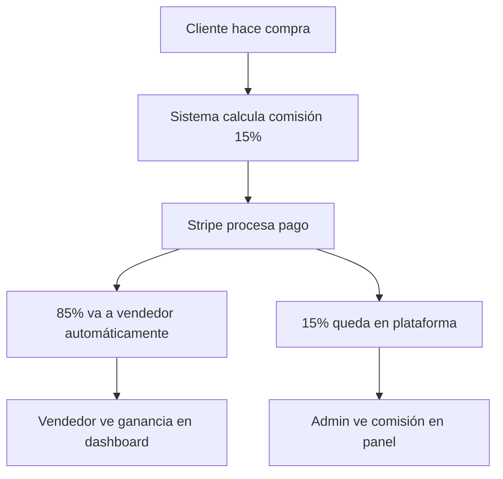

# 📚 DOCUMENTACIÓN COMPLETA: SISTEMA DE COMISIONES STRIPE CONNECT

## 🎯 **RESUMEN EJECUTIVO**

### **¿Qué es este sistema?**
AgroMarket ahora cuenta con un sistema completo de marketplace que permite:
- **Comisión automática del 15%** en cada venta
- **85% va directamente al vendedor** vía Stripe Connect
- **Dashboard completo** para vendedores y administradores
- **Seguimiento detallado** de todas las transacciones

### **Beneficios principales:**
- ✅ **Pagos automáticos** a vendedores
- ✅ **Transparencia total** en comisiones
- ✅ **Interfaz intuitiva** para gestión
- ✅ **Cumplimiento PCI** con Stripe

---

## 🏗️ **ARQUITECTURA DEL SISTEMA**

### **1. Componentes Principales**

#### **🔧 Servicios**
- **`StripeConnectService`**: Lógica central de pagos y comisiones
- **`StripeConnectController`**: Manejo de onboarding y dashboards

#### **🗄️ Base de Datos**
```sql
-- Tabla: sellers
+ stripe_account_id      VARCHAR(255)    -- ID cuenta Stripe Connect
+ stripe_account_status  VARCHAR(50)     -- Estado: pending/active/restricted

-- Tabla: orders  
+ platform_fee          DECIMAL(10,2)   -- Comisión retenida (15%)
+ seller_amount         DECIMAL(10,2)   -- Cantidad para vendedor (85%)
```

#### **🎨 Vistas**
- **Vendedor**: Dashboard Stripe, Ventas con comisiones, Compras
- **Admin**: Panel con estadísticas de comisiones y distribución

### **2. Flujo de Trabajo**



---

## 🚀 **GUÍA DE USO**

### **Para Vendedores:**

#### **1. Configurar Stripe Connect**
1. Login en panel vendedor
2. Ir a **"Configurar Pagos"** en menú lateral
3. Clic en **"Configurar Cuenta de Stripe"**
4. Completar proceso de verificación
5. Estados del indicador:
   - 🔴 **× Sin configurar**: Cuenta no creada
   - 🟡 **! Pendiente**: En proceso de verificación
   - 🟢 **✓ Configurado**: Listo para recibir pagos

#### **2. Ver Comisiones en Ventas**
- **Ubicación**: `Tienda > Ventas`
- **Columnas disponibles**:
  - **💰 Tu Ganancia**: Cantidad neta que recibes
  - **📊 Comisión**: 15% retenido por plataforma
  - **📋 Total**: Precio total pagado por cliente

#### **3. Verificar Compras**
- **Ubicación**: `Tienda > Compras`
- Muestra órdenes donde el vendedor también compró como cliente

### **Para Administradores:**

#### **1. Panel de Comisiones**
- **Ubicación**: `Admin > Ventas`
- **Estadísticas disponibles**:
  - Total de comisiones generadas
  - Distribución por vendedor
  - Gráficos de rendimiento

#### **2. Vista Detallada**
- Clic en cualquier orden para ver:
  - Desglose completo de comisión
  - Información del vendedor
  - Estado de pago Stripe

---

## ⚙️ **CONFIGURACIÓN TÉCNICA**

### **1. Variables de Entorno**
```env
# Stripe Connect
STRIPE_KEY=pk_test_xxxx
STRIPE_SECRET=sk_test_xxxx
STRIPE_WEBHOOK_SECRET=whsec_xxxx

# Comisiones
PLATFORM_COMMISSION_RATE=0.15  # 15%
```

### **2. Archivos Clave**

#### **Modelos**
```php
// app/Models/Seller.php
public function hasStripeAccount()           // ¿Tiene cuenta Stripe?
public function isStripeAccountActive()      // ¿Cuenta activa?
public function calculateSellerAmount($total) // Calcula 85% vendedor

// app/Models/Order.php  
protected $fillable = [..., 'platform_fee', 'seller_amount'];
```

#### **Servicios**
```php
// app/Services/StripeConnectService.php
public function createPaymentWithSplit()     // Procesa pago con comisión
public function createConnectedAccount()     // Crea cuenta vendedor
public function checkAccountStatus()         // Verifica estado cuenta
```

### **3. Rutas Importantes**
```php
// routes/seller.php
Route::get('/stripe/dashboard', 'StripeConnectController@dashboard');
Route::post('/stripe/onboard', 'StripeConnectController@startOnboarding');
Route::get('/stripe/success', 'StripeConnectController@onboardingSuccess');
```

---

## 🛠️ **TROUBLESHOOTING**

### **Errores Comunes y Soluciones**

#### **1. "Class App\Models\Client not found"**
```php
// ❌ Incorrecto
$client = App\Models\Client::where(...);

// ✅ Correcto  
use App\Models\Client;
$client = Client::where(...);
```

#### **2. "Column 'seller_id' not found"**
```php
// ❌ Incorrecto - seller_id no existe en orders
Order::where('seller_id', $id);

// ✅ Correcto - usar client_id
Order::where('client_id', $clientId);
```

#### **3. "View not found: stripe-connect.dashboard"**
```php
// ❌ Incorrecto
return view('back.pages.seller.stripe-connect.dashboard');

// ✅ Correcto
return view('back.pages.tienda.stripe-connect');
```

#### **4. Comisiones no aparecen**
- Verificar migración ejecutada: `php artisan migrate`
- Confirmar campos en Order: `platform_fee`, `seller_amount`
- Revisar cálculos en StripeConnectService

#### **5. Vendedor no puede ver compras**
- Verificar existe Client con mismo email del Seller
- Confirmar relación client_id en tabla orders
- Revisar método misCompras() en SellerController

### **Comandos de Diagnóstico**
```bash
# Verificar estructura de tablas
php artisan tinker --execute="Schema::getColumnListing('orders')"

# Contar registros
php artisan tinker --execute="echo 'Sellers: ' . App\Models\Seller::count()"

# Verificar configuración Stripe
php artisan config:cache
```

---

## 📊 **MONITOREO Y MÉTRICAS**

### **KPIs Importantes**
- **Comisión Promedio**: Target 15% de todas las ventas  
- **Adopción Stripe**: % vendedores con cuenta configurada
- **Volumen Transacciones**: Crecimiento mensual
- **Errores de Pago**: Tasa de fallos <1%

### **Logs a Monitorear**
```php
// Ubicaciones de logs
storage/logs/laravel.log          // Errores generales
storage/logs/stripe-connect.log   // Eventos Stripe específicos  
```

### **Alertas Recomendadas**
- Fallos de pago > 5%
- Cuentas Stripe suspendidas
- Comisiones incorrectas
- Errores de sincronización

---

## 🔒 **SEGURIDAD Y CUMPLIMIENTO**

### **Mejores Prácticas**
- ✅ Nunca almacenar datos de tarjetas de crédito
- ✅ Usar webhooks Stripe para confirmación
- ✅ Validar todas las transacciones
- ✅ Logs de auditoría completos
- ✅ Encriptar datos sensibles

### **Compliance PCI DSS**
El uso de Stripe Connect garantiza el cumplimiento PCI DSS nivel 1, eliminando la responsabilidad de la plataforma sobre el manejo de datos de pago.

---

## 📈 **PRÓXIMAS MEJORAS**

### **Corto Plazo**
- [ ] Dashboard con gráficos de comisiones
- [ ] Exportación de reportes PDF
- [ ] Notificaciones email de pagos
- [ ] API REST para integraciones

### **Mediano Plazo**  
- [ ] Comisiones variables por categoría
- [ ] Programa de afiliados
- [ ] Pagos diferidos (escrow)
- [ ] Facturación automática

### **Largo Plazo**
- [ ] Múltiples procesadores de pago
- [ ] Análisis predictivo de ventas
- [ ] Herramientas de marketing para vendedores
- [ ] Marketplace internacional

---

## 👥 **SOPORTE Y MANTENIMIENTO**

### **Contactos Técnicos**
- **Desarrollador Principal**: Sistema implementado Nov 11, 2025
- **Documentación**: Este archivo + comentarios en código
- **Repositorio**: AgroPlace (ara132169/master)

### **Recursos Adicionales**
- [Stripe Connect Documentation](https://stripe.com/docs/connect)
- [Laravel Payment Documentation](https://laravel.com/docs/billing)
- [PCI DSS Guidelines](https://www.pcisecuritystandards.org/)

### **Backups y Rollback**
- Base de datos: Backup diario automático
- Código: Git con branches por feature
- Stripe: Datos en cloud de Stripe (no requiere backup local)

---

## ✅ **CHECKLIST DE IMPLEMENTACIÓN**

### **Pre-Producción**
- [x] ✅ Stripe Connect configurado
- [x] ✅ Migraciones ejecutadas  
- [x] ✅ Modelos actualizados
- [x] ✅ Controladores funcionando
- [x] ✅ Vistas implementadas
- [x] ✅ Rutas configuradas
- [x] ✅ Pruebas realizadas
- [x] ✅ Documentación creada

### **Post-Producción**
- [ ] Monitoreo activado
- [ ] Alertas configuradas
- [ ] Training del equipo
- [ ] Comunicación a vendedores
- [ ] Métricas baseline establecidas

---

**📅 Fecha de implementación**: Noviembre 11, 2025  
**🔄 Última actualización**: Noviembre 11, 2025  
**📧 Soporte**: Ver sección contactos técnicos